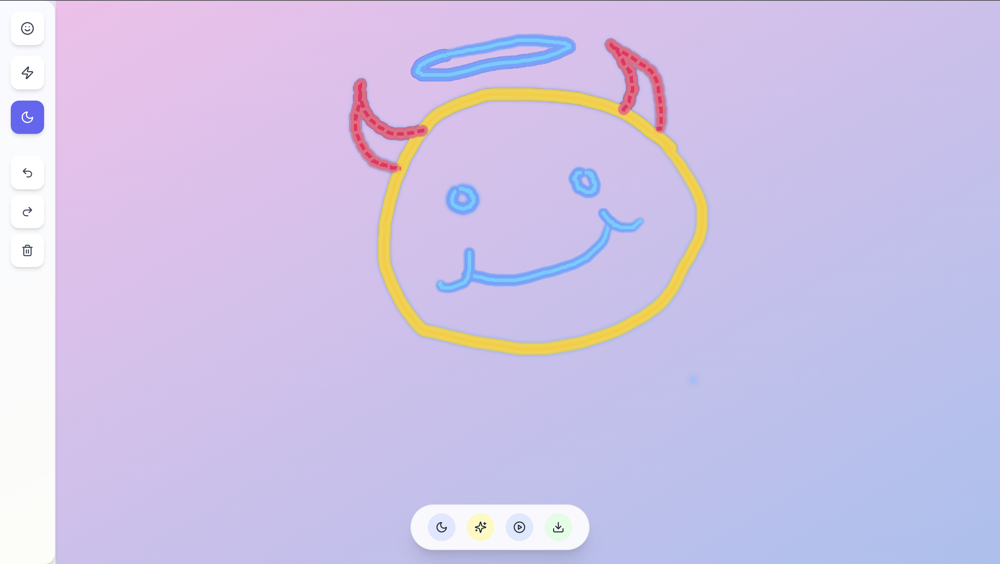

# 🧠 MoodCanvas

A beautifully crafted, emotion-powered drawing app built in **React + Tailwind**.  
🎨 Pick your mood. 🖌️ Draw your thoughts. 🌗 Toggle themes. 🌀 Replay your strokes.  

This project is built for creative flow, intuitive interaction, and visual polish — a **frontend-only masterpiece** designed to win hackathons.

---

## 📸 Preview



---

## ✨ Features

| 🌈 Mood-Based Brushes | Choose between **Joy**, **Chaos**, and **Calm**. Each mood changes the color, shadow, and stroke style. |
|-----------------------|-----------------------------------------------------------------------------------------------------|
| 🧠 Live Brush Preview | See your brush follow your cursor with real-time size and glow.                                      |
| 🌗 Theme Modes        | Toggle between **Daylight**, **Dusk**, and **Night** themes. Dynamic gradients keep it elegant.     |
| 🌀 Timelapse Replay   | Replay your brush strokes step-by-step — like a drawing memory lane.                                |
| 🧼 Undo & Redo        | Go back or forward through your drawing history without distortion or scale issues.                 |
| 📥 Export Drawing     | Download your art with one click as a `.png` snapshot.                                               |
| ✨ Intro Modal        | On first load, users are greeted with an elegant feature-rich welcome screen.                       |
| 💬 Contextual Hints  | Hovering over any icon reveals its purpose with smooth floating tooltips.                           |

---

## 🧪 Tech Stack

- ⚛️ React (Create React App)
- 🌬️ Tailwind CSS
- 🎨 react-colorful (for color picker, if needed)
- 🖼️ HTML Canvas API
- 🧠 React Context (state sharing across components)
- 🧰 Lucide Icons (for aesthetic, consistent icons)

---

## 📁 Folder Structure

```
src/
├── components/
│   ├── Canvas.jsx
│   ├── Toolbar.jsx
│   ├── Dock.jsx
│   ├── BrushPreview.jsx
│   ├── IntroModal.jsx
│   ├── TooltipLabel.jsx
│   └── ToolButton.jsx
├── context/
│   └── CanvasContext.jsx
├── hooks/
│   ├── useCanvas.js
│   └── useCanvasInitializer.js
├── App.js
├── index.js
└── index.css
```

---

## 🚀 Getting Started

### 1. Clone the Repo

```bash
git clone https://github.com/yourusername/moodcanvas.git
cd moodcanvas
```

### 2. Install Dependencies

```bash
npm install
```

### 3. Run the App

```bash
npm start
```

> Runs the app in development mode — open [http://localhost:3000](http://localhost:3000) to view it in the browser.

---

## 🧠 Key Logic Notes

- All mood settings, background themes, brush sizes, and canvas controls are managed via **React Context**.
- Undo/redo works by saving **image snapshots** (`canvas.toDataURL()`), and restoring with safe scaling.
- The canvas uses **devicePixelRatio** scaling for Retina/high-res support.
- Brush stroke replay is animated line-by-line with async loops.
- No backend, no external auth — just pure frontend finesse.

---

## 📦 Build

```bash
npm run build
```

> Creates a production-ready build in the `build/` folder. You can deploy it on **Verbal**, **Netlify**, **Vercel**, or any static host.

---

## 💡 Ideas for Future Enhancements

- Add **custom color picker**
- Add **pressure-sensitive drawing** (with pointer events)
- Allow **saving multiple artworks**
- Add **lightning reaction stroke effects**
- Collaborative canvas (multi-user drawing)

---

## 🧑‍🎨 Made with ❤️ by Ayushmaan